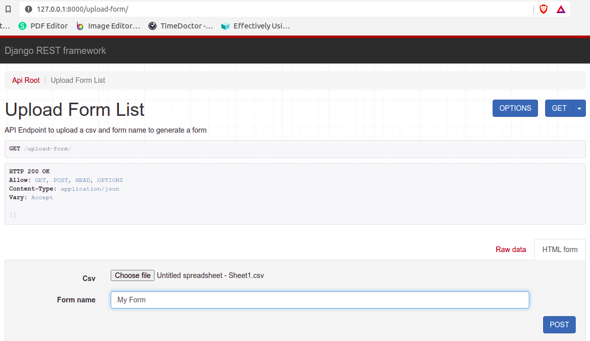
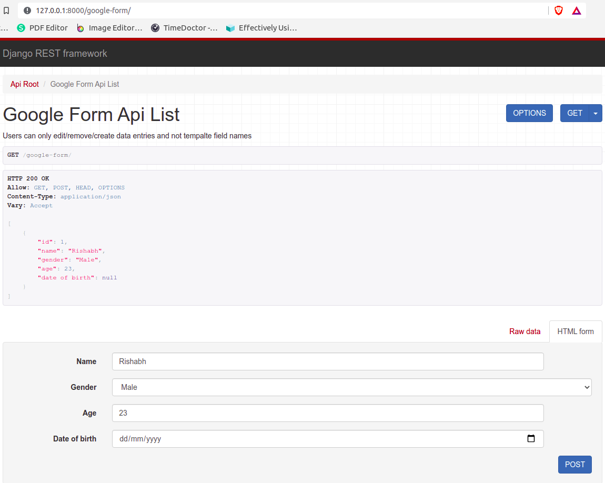

# pillar-plus-assignment

> **Task**:

      Design and implement a service like Google Forms:
          Users can create a form template by defining a form name & defining the form fields.
          The form fields are defined using a csv file.
          The form fields will be defined by following parameters:
              Field_name: Specifying the name of the field
              Type: The front-end will collect data as this type of entry
                   1. Text
                   2. Single select
                   3. Number
                   4. Date
              Options: Only for single select type, null for other types. Mentions values to show amongst which a single selection will be made.
              Mandatory: Whether it is mandatory to enter data in that field or not (a condition for the front-end to check before form submission)
          Once a form template is created, users can fill the form multiple times creating multiple form entries
          Users can create, update, delete entries for a form template

> **How to get the project running ?**

     1. Create an virutal env & activate it.

     2. RUN the following commands:
                 > pip3 install -r requirements.txt 
                 > python3 manage.py runserver

> **Endpoints**

     1. Upload Form Template API: CSV & Form Name

        http://127.0.0.1:8000/upload-form/

     2. Add data to the generated form API:

        http://127.0.0.1:8000/google-form/

> **Steps**:

      1. Upload Form CSV (ONLY .CSV FILES Supported) & Add the Form Name in Upload Form Template API (http://127.0.0.1:8000/upload-form/)

      2. After you submit the request, API will redirect you to the generated form API by fetching details of your
         form fields csv (http://127.0.0.1:8000/google-form/)

      3. Users can then perform create, update, delete entries in the form.

      

         
 
       
       
Please let me know if you have any queries

Rishabh Mishra

mishrarishabh404it@gmail.com
